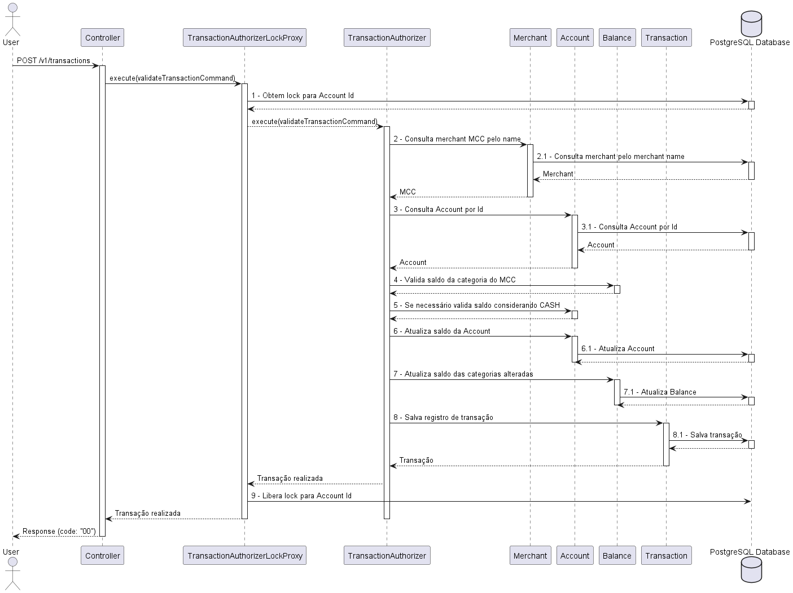

# Credit Card Transaction Authorization API

API responsável por autorizar transaçôes de cartâo de crédito.

## Tabela de conteúdos
- [Desafios propostos](#Desafios)
    - [L1 - Autorizador simples](#l1)
    - [L2 - Autorizador com fallback](#l2)
    - [L3 - Autorizador com fallback](#l3)
    - [L4 - Problema de concorrencia](#l4)
- [Requisitos](#Requisitos)
- [Configuração](#Configuracao)
- [API Endpoints](#api-endpoints)
    - [Authorize Transaction](#authorize-transaction)

## Desafios propostos

- Segue abaixo a descrição de como cada desafio foi resolvido:

### L1 - Autorizador simples

- Ao receber uma transação o MCC recebido é utilizado para mapear o saldo para categoria correta, então a Account é consultada no banco de dados e caso o saldo da categoria seja disponível o saldo é debitado e a transação é salva e aceita, caso contrario a transação é rejeitada;

### L2 - Autorizador com fallback

- Caso não exista uma categoria de saldo para o MCC recebido ou o saldo da categoria do MCC não for o suficiente, então, o saldo da categoria CASH será utilizado para debitar a transacao.
- Funciona da seguinte forma, primeiro é validado se o saldo da categoria do MCC é o suficiente, se sim, a transação é authorizada. Caso contrario, verificamos o saldo total livre da Account considerando o saldo da categoria do MCC + Saldo de CASH. Caso o saldo da categoria + saldo de CASH for o suficiente autorizamos a transação, caso contrário a transação é rejeitada;

### L3 - Autorizador com fallback

- Ao receber uma transação uma consulta de merchant em uma base de merchants é realizada (Poderia ser uma API externa). Caso um merchant for encontrado usamos o MCC do merchant cadastrado na base, caso nenhum merchant for encontrado utilizamos o MCC enviado na request;

### L4 - Problema de concorrência

- Para evitar que mais de uma transação concorrente aconteça ao mesmo tempo para uma mesma Account, levando o saldo da account para um estado inconsistente, utilizei uma estratégia de Lock externo.
- Para criar este Lock externo utilizei o próprio PostgreSQL (Poderia ser um Redis ou qualquer outro recurso externo que pudesse ser utilizado de forma compartilhada) porém escolhi o Postgres para utilizar como Lock externo por já estar utilizando o banco no projeto e nao precisar adicionar mais uma dependência externa.
- Para realizar o Lock com o Postgres também utilizei as Libs do Spring `spring-boot-starter-integration` e `spring-integration-jdbc`;
- Funciona da seguinte forma: Ao receber uma transação para uma Account, antes do controller redirecionar a operação para um UseCase a transação vai passar por um proxy 
deste UseCase. Este proxy vai pegar o código da Account, tentar obter um Lock para ela, caso o Lock seja obtido a transação seguirá. Se alguma outra transação concorrente neste mesmo período tentar fazer uma transação para a mesma Account, ela não vai conseguir obter o Lock e prosseguir com a transação, ela vai ter que esperar a primeira transação finalizar e liberar o Lock para que ela possa prosseguir, evitando assim que duas transações aconteçam ao mesmo tempo para a mesma account.
- Como o Lock é realizado de forma externa com o Postgres isto também funciona para um cenário distribuido, onde esta aplicação é escalada de forma horizontal e tenha mais de uma instância em execução.
- O diagrama abaixo (Simplificado) ilustra como uma transação é executada (Cenário Feliz) utilizando o Lock com Postegres;



## Requisitos

- Java 21
- Maven
- PostgreSQL

## Configuração

- Necessário ter Java 21+ com maven para conseguir rodar a aplicacao;
- Voce pode usar o arquivo `docker-compose.yaml` deste projeto para subir uma base Postgres para rodar este projeto;
- Caso não queira rodar a aplicação com um banco de dados externo você pode definir a propriedade `spring.profiles.active=dev` no arquivo `src/main/resources/application.properties` para rodar a aplicação localmente usando o banco de dados H2;


## API Endpoints

### Authorize Transaction

- Url `http://localhost:8080/v1/transactions`
- Metodo `POST`
- Request Body
```json
{
    "account": "1",
    "totalAmount": 50.10,
    "mcc": "5411",
    "merchant": "PADARIA DO ZE               SAO PAULO BR"
}
```

- Response Status Code `200`
- Response Body
```json
{
    "code": "00"
}
```

- Códigos de status de retorno

| Code     | Descricao                                                     |
|----------|---------------------------------------------------------------|
| 00       | Transação autorizada com sucesso                              |
| 51       | Transação rejeitada, conta sem saldo o suficiente             |
| 07       | Transação rejeitada, ocorreu algum erro durante a autorização |
